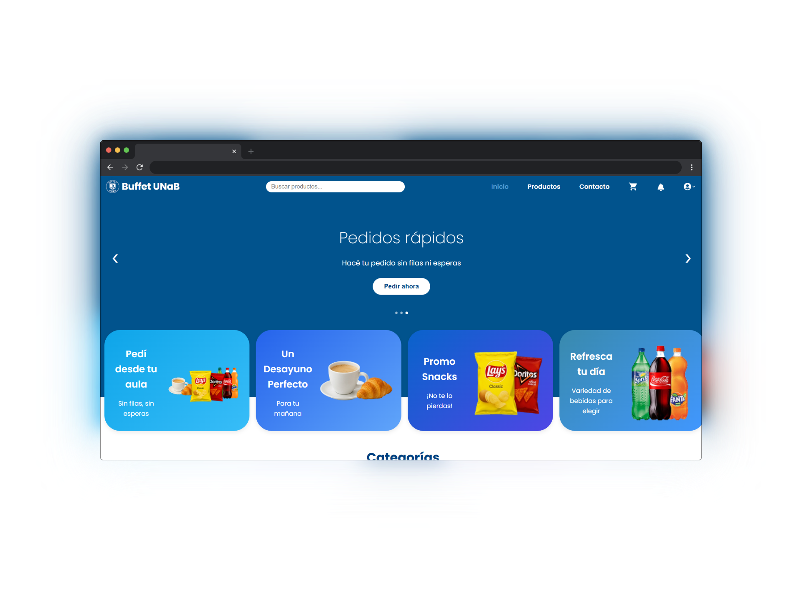

# Buffet-Gestor de pedidos - UNaB (repositorio Front End)

## 📌 Descripción
Repositorio del front-end para una web del buffet de la Universidad Nacional Guillermo Brown, desarrollado como trabajo final de la materia Prácticas Profesionales Supervisadas.
El objetivo principal es permitir que los estudiantes realicen pedidos online, reduciendo tiempos de espera y mejorando la organización del servicio, incluyendo también facilidades en la gestión de pedidos para los administradores.

<p align="center">
  
</p>

## 🚀 Tecnologías
- **Frontend**: React + Vite + CSS
- **Backend**: Node.js con Express
- **Base de datos**: MySQL
- **Control de versiones**: Git + GitHub

## 👥 Integrantes
- Diaz, Gonazalo
- Lozada, Alejandro
- Lozada, Solange
- Maldonado, Rocio
- Montenegro, Thiago
- Sayago, Julieta


## 🎯 Objetivos
- Facilitar pedidos online de los estudiantes.
- Reducir filas y tiempos de espera.
- Mejorar la gestión del buffet.

## ⭐ Características principales
- Sistema de pedidos online para estudiantes.
- Visualización de menú y productos del buffet.
- Carrito de compras y confirmación de pedidos.
- Generación y lectura de códigos QR para retirar pedidos.
- Panel para administradores: gestión de productos y pedidos.

---

## 🛠️ Instalación y ejecución del frontend

### Prerrequisitos
- Node.js v18+  
- Git instalado  
- Navegador moderno (Chrome, Firefox, Edge)

### Paso a paso
1. **Clonar el repositorio**
   ```bash
   git clone https://github.com/julisayago/buffet-frontend.git
   cd buffet-frontend
   ```
   
2. **Instalar dependencias**
   ```bash
   npm install
   ```

3. **Configurar variables de entorno**
   Crear un archivo .env en la raíz del frontend:
   ```bash
   VITE_API_URL=http://localhost:3000/api
   ```
   Ajustar VITE_API_URL según la URL del backend.

4. **Levantar el servidor de desarrollo**
   ```bash
   npm run dev
   ```
   Abrir en el navegador la URL que muestra Vite (por defecto http://localhost:5173).

## 📌 Scripts útiles

| Comando           | Descripción                                      |
|-------------------|--------------------------------------------------|
| `npm run dev`     | Inicia el servidor de desarrollo con Vite        |
| `npm run build`   | Compila el proyecto para producción (`dist/`)    |

## 📁 Estructura del proyecto

```plaintext
BUFFET-ECOMMERCE-UNIVERSIDAD/
├── public/                    # Archivos estáticos
├── src/                       # Código fuente principal
│   ├── assets/                # Imágenes
│   ├── components/            # Componentes reutilizables de React
│   ├── config/                # Configuraciones
│   ├── layout/                # Componentes de layout
│   ├── pages/                 # Páginas del sistema (home, login, pedidos, etc.)
│   └── routes/                # Definición de rutas y navegación
├── App.css                    # Estilos del componente principal
├── App.jsx                    # Componente raíz de la aplicación
├── index.css                  # Estilos globales
├── main.jsx                   # Punto de entrada de React
├── eslint.config.js           # Configuración de ESLint
├── index.html                 # Plantilla HTML principal
├── package-lock.json          # Mapa exacto de dependencias
├── package.json               # Metadatos y scripts del proyecto
└── vite.config.js             # Configuración de Vite
 ```

### 🧩 Dependencias principales

| Dependencia     | Descripción breve                           |
|-----------------|---------------------------------------------|
| html5-qrcode    | Leer códigos QR desde la cámara del usuario |
| qrcode.react    | Generar códigos QR en componentes React     |
| react           | Librería principal para crear la interfaz   |
| react-dom       | Renderiza los componentes en el navegador   |
| react-icons     | Íconos listos para usar en React            |
| react-router-dom| Navegación entre páginas y rutas SPA        |
| react-toastify  | Mostrar notificaciones tipo *toast*         |
